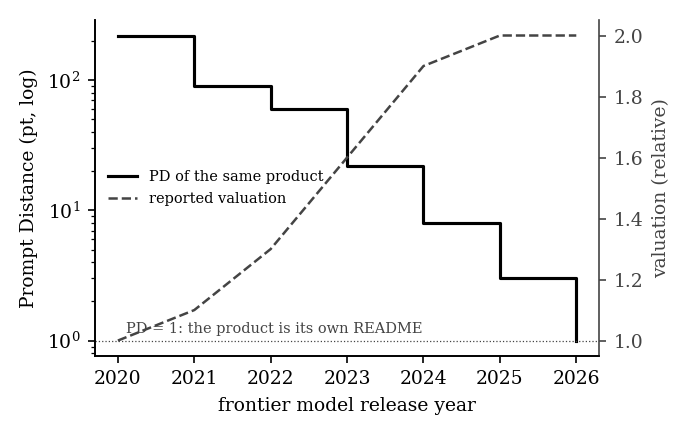
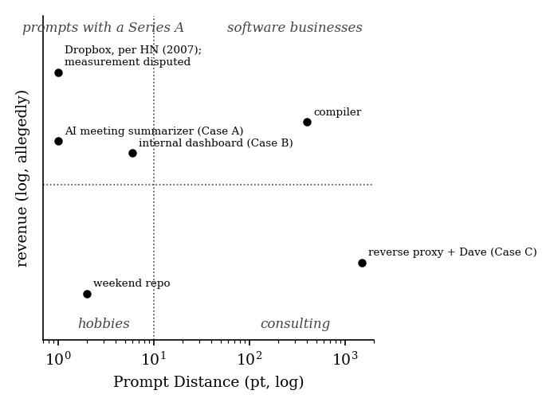
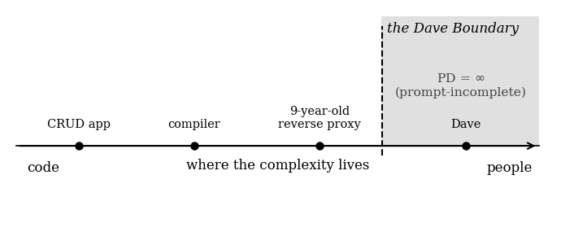

# Prompt Distance: A Unified Metric for Software Triviality in the Post-Generative Era

**Version 0.1 (Draft)**
**June 2026**

---

## Abstract

We introduce **Prompt Distance (PD)**, a complexity metric defined as the minimum number of prompts required to reproduce a software artifact from an empty directory using a contemporary large language model. While prior art in software estimation has focused on effort (person-months), size (lines of code), or architecture (story points, none of which anyone believes), no existing metric captures the increasingly relevant question: *could this entire company be replaced by a paragraph of text?* We formalize PD, propose a measurement protocol, define the canonical triviality classes PD-0 through PD-∞, and demonstrate through case studies that a substantial fraction of venture-funded software exhibits PD ≤ 1. We conclude that Prompt Distance is the natural successor to Kolmogorov complexity for an industry that has stopped writing programs and started describing them.

---

## 1. Introduction

For seventy years, the software industry has lacked a rigorous vocabulary for the sentiment "this isn't a real project." Practitioners have relied on informal estimators:

- *"I could build this in a weekend"* (the Weekend Conjecture, unfalsifiable since no practitioner has ever had a free weekend);
- *"This is trivially done with rsync"* (Hacker News, 2007, in response to Dropbox — a landmark result in being technically correct and economically catastrophic);
- *"It's just a GPT wrapper"* (2023–present, an architectural observation lacking quantification).

These heuristics share a fatal flaw: they measure the *speaker's confidence*, not the *artifact's complexity*. Prompt Distance resolves this by anchoring triviality to a reproducible, external oracle: the language model itself.

The core insight is that generative models have collapsed the cost of *implementation* to near zero, leaving *specification* as the only remaining work. A project's true complexity is therefore not what it took to build, but what it would take to *describe*. A product that can be fully specified in one prompt was never a product. It was a prompt with a Series A.

## 2. Definition

**Definition 1 (Prompt Distance).** Let $x$ be a software artifact, $M$ a contemporary frontier language model, and $P = (p_1, p_2, \ldots, p_n)$ an ordered sequence of prompts. Then:

$$PD(x) = \min \\{ |P| : \mathrm{eval}(M, P) \cong x \\}$$

where $\mathrm{eval}(M, P)$ denotes the artifact produced by submitting $P$ sequentially to $M$ in a fresh session, and $\cong$ denotes *functional equivalence as judged by the artifact's own marketing site*.

**Definition 2 (Functional equivalence, ≅).** Two artifacts are functionally equivalent if a user of the original, given the reproduction, would not notice for at least one billing cycle.

Several properties follow immediately:

**Property 1 (Monotonic decay).** $PD(x)$ is non-increasing in time, since $M$ improves while $x$ does not. A project that was PD-40 in 2021 may be PD-2 today. We refer to this as **prompt rot**, and note that it affects valuations on a considerable lag.

*Figure 1: Prompt rot. PD of the same fictional product across frontier model releases (solid, log scale), against its reported valuation (dashed). The lines have not yet met. They will.*

**Property 2 (Non-compositionality).** $PD(A + B) \leq PD(A) + PD(B)$, and frequently $PD(A + B) = 1$, because the model does not respect how hard the integration meeting was.

**Property 3 (Observer independence).** Unlike the Weekend Conjecture, PD does not depend on the estimator's ego. It can be measured by anyone with an API key and the will to hurt feelings.

## 3. Units and Notation

The SI unit of Prompt Distance is the **prompt (pt)**, defined as one user message to a frontier model in a fresh session at default settings, with no retries. Standard notation:

- $PD(x) = n$ — "$x$ is $n$ prompts away."
- **PD-1** (adjective) — one-shottable. *"It's a PD-1 product."*
- **ε-prompt** — a follow-up that merely fixes what the model got wrong; ε-prompts count, which is why almost nothing is truly PD-1 and why claiming PD-1 anyway is called **rounding down to zero engineering**.

Reproductions requiring retries, regenerations, or pleading are denominated in **prompt-equivalents (pt-eq)** and must disclose temperature.

## 4. The Triviality Hierarchy

| Class | PD | Designation | Description |
|-------|-----|-------------|-------------|
| **PD-0** | 0 | *Pre-existing* | The artifact already exists as a library, a Unix utility, or a feature of the OS. No prompt is needed because no project was needed. The Dropbox–rsync comment asserted, incorrectly, that Dropbox was PD-0. |
| **PD-1** | 1 | *One-shottable* | Fully reproducible from a single prompt. The project is, in an information-theoretic sense, its own README. Most "AI-powered" productivity tools live here. |
| **PD-2…9** | 2–9 | *Conversational* | Requires a short dialogue. Often indicates one (1) genuine design decision, surrounded by boilerplate. |
| **PD-10…99** | 10–99 | *Engineered* | Actual accumulated decisions, state, and edge cases. Congratulations: it is software. |
| **PD-100+** | ≥100 | *Load-bearing* | The prompts would constitute a specification longer than the code. Compilers, kernels, payment systems, anything touching timezones. |
| **PD-∞** | ∞ | *Prompt-incomplete* | Cannot be reproduced by prompting at any length, because the hard part is not the code (regulatory moats, network effects, a guy named Dave who knows where the bodies are buried). |

*Figure 2: The Triviality Plane. Prompt Distance against revenue. Note that the upper-left quadrant is not empty, which is the entire point of this paper. Revenue axis unlabeled at the request of everyone plotted on it.*

**Remark.** The hierarchy is not a value judgment on revenue. PD-1 products can be excellent businesses. The metric measures *defensibility against a teenager with a Claude subscription*, which is a different axis, and lately the more important one.

## 5. Measurement Protocol

To assign a PD score, the assessor SHALL:

1. **Freeze the target.** Screenshot the marketing page. This is the spec — the artifact is only obligated to do what it claims, which is usually less than feared.
2. **Open a fresh session** with a frontier model. No system prompt, no custom instructions. Bringing your own scaffolding is doping.
3. **Prompt until functional equivalence** (Definition 2) is reached, counting every message including ε-prompts.
4. **Report PD with provenance:** model, date, and transcript. Unverifiable claims of "I one-shotted it" are inadmissible and shall be treated as Weekend Conjectures.

Because of Property 1 (prompt rot), all scores MUST be dated: *"PD(x) = 3 (claude-fable-5, 2026-06)."* An undated PD score is as meaningless as an undated currency amount.

### 5.1 Field Estimation (the Rubric)

The full protocol is the standard of proof, but it requires actually doing it, and most PD disputes occur in comment sections. For field conditions we provide a conservative estimator computable from the marketing page alone. Start from PD = 64 and halve for each "no":

1. Does correctness depend on knowledge that is not on the first page of search results (an algorithm, a spec, a domain)?
2. Does it hold persistent state that would be painful to lose?
3. Does it integrate with more than two external systems that can each fail independently?
4. Does it have a compliance surface (HIPAA, PCI, GDPR, timezones)?
5. Has it been in production long enough for users to depend on its bugs?
6. Is there a Dave?

Six noes yields PD = 1. The rubric deliberately cannot output PD = 0: a PD-0 verdict requires the humility of checking whether rsync already does it, and nobody reaching for a rubric has that. We acknowledge that the rubric is itself an unfalsifiable confidence-based estimator — a Weekend Conjecture with arithmetic. Transcripts remain the standard of proof; the rubric is for arguing.

**Erratum.** An earlier draft of question 1 asked about authentication instead, measuring operational complexity only; under that draft, compilers scored PD = 4. The rubric has been revised. The compilers have not.

## 6. Case Studies (Anonymized)

**Case A — "AI meeting summarizer," $4M seed.** PD = 1. The reproduction's prompt was shorter than the company's About page. Notably, the original product's system prompt was later leaked and found to be *the same prompt*, establishing the first known case of **PD fixed-point**: a product equal to its own reproduction instructions.

**Corollary 1 (No product is a fixed point twice).** Any product that includes its own PD score in its marketing has increased its PD by exactly the length of that claim. Self-description is not free; a system cannot advertise its own triviality without becoming marginally less trivial. We believe this is the closest the field will come to an incompleteness result, and we are comfortable with that.

**Case B — Internal CRUD dashboard, 14 months, 3 engineers.** PD = 6, of which 4 were ε-prompts about authentication. The two real prompts were the data model and a request to make it "less ugly." Estimated historical effort: 4,200 person-hours. Estimated prompt effort: 11 minutes. The delta is termed **legacy dignity** and is not recoverable.

**Case C — A reverse proxy in production for 9 years.** PD = ∞. Not because the code is complex, but because functional equivalence requires reproducing the undocumented behavior that four downstream teams secretly depend on. This illustrates the **Dave Boundary**: the point past which complexity lives in people, not artifacts, and no prompt can reach it.

*Figure 3: The Dave Boundary. Artifacts to the left of the boundary can be reproduced by prompting. Dave cannot. Dave has not updated his documentation since 2019 and remains undefeated.*

## 7. Threats to Validity

- **Oracle drift.** PD is defined relative to "a contemporary frontier model," a phrase with a half-life of four months. This is a feature: triviality is, and has always been, time-indexed.
- **The specification smuggling problem.** A sufficiently detailed single prompt can encode arbitrary complexity ("just write the prompt very carefully" — i.e., programming). We therefore cap prompts at the length the author would actually write while annoyed, formally the **Annoyance Bound**.
- **Assessor motivation.** This metric was developed by an engineer who was irritated by a specific product. We consider this not a bias but a *methodology*, consistent with the entire history of developer tooling.
- **Survivorship of the smug.** PD-0 verdicts have a poor track record (see: rsync). A low PD predicts reproducibility, not market outcome. Confusing the two is left as an exercise for the commenter.

## 8. Related Work

Kolmogorov [1] defined the complexity of an object as the length of its shortest description — but denominated in program bits, an obsolete currency. Brooks [2] established that adding manpower to a late project makes it later; we extend this with the corollary that adding prompts to a PD-1 project makes it PD-1 with a roadmap. Boehm [3] estimated software effort from source lines of code, a unit the industry has since stopped producing by hand. The Hacker News Dropbox comment [4] is the field's foundational negative result. Hyrum's Law [5] underlies rubric question 5: with enough users, every observable behavior of a system will be depended on by somebody, and no prompt reproduces an observable nobody wrote down. "Vibe coding" [6] describes the *production* of low-PD software; this work provides its *detection*. The properties of the region beyond the Dave Boundary are known to the field primarily through personal communication [7].

## 9. Conclusion and Future Work

Prompt Distance gives the industry what it has long deserved: a way to say "this is one prompt away from not existing" with a citation. Future work includes **PD futures** (pricing in expected prompt rot at the next model release), the **PD audit** as a due-diligence standard, and an empirical census of public SaaS, pending legal review and the author's remaining goodwill.

We invite the community to measure responsibly, disclose transcripts, and remember the central lesson of the rsync incident: a low Prompt Distance means the software is trivial. It does not mean the business is. Those are different papers.

## References

1. Kolmogorov, A. N. (1965). Three approaches to the quantitative definition of information. *Problems of Information Transmission*, 1(1), 1–7.
2. Brooks, F. P. (1975). *The Mythical Man-Month: Essays on Software Engineering*. Addison-Wesley.
3. Boehm, B. W. (1981). *Software Engineering Economics*. Prentice-Hall.
4. BrandonM (2007). Comment on "My YC app: Dropbox — Throw away your USB drive." *Hacker News*. https://news.ycombinator.com/item?id=9224
5. Wright, H. (n.d.). Hyrum's Law. https://www.hyrumslaw.com
6. Karpathy, A. (2025). "There's a new kind of coding I call 'vibe coding' …" *X*, February 2025.
7. Dave (2019). Personal communication. Undocumented.

---

*Comments, refutations, and PD scores of this whitepaper itself (current estimate: PD = 2 — one for the whitepaper, one for the LaTeX) are welcome. By Corollary 1, publishing this estimate has made it wrong.*
